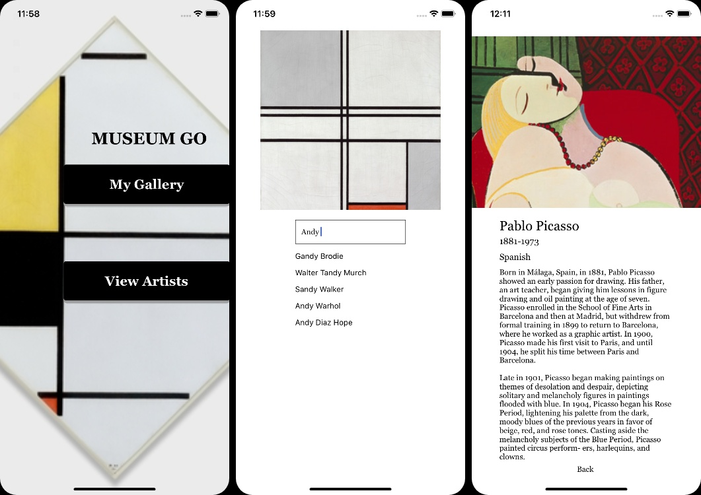
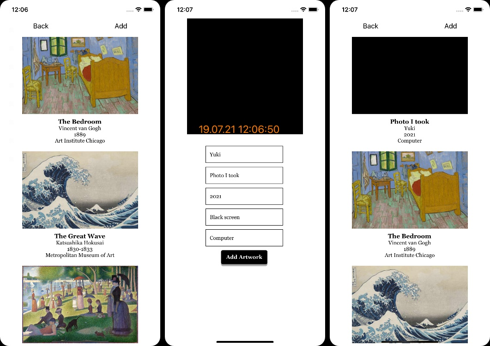

# Museum Go
build your own art gallery by taking/saving pictures of your favorite artworks and it also enables you to look up artists' biography

<!-- ABOUT THE APPLICATION -->
## About The Application

build your own art gallery by taking/saving pictures of your favorite artworks and it also enables you to look up artists' biography

### Built With

* [Expo](https://reactjs.org/)
* [React Native](https://reactnative.dev/)
* [Express](https://expressjs.com/)

<!-- GETTING STARTED -->
## Getting Started
To get a local copy up and running follow these simple steps.

### Prerequisites

* npm
  ```sh
  npm install
  ```

### Installation

1. Clone the repo
   ```sh
   git clone https://github.com/yukiyamamoto710/museum-go.git
   ```
2. Get an API Key at https://developers.artsy.net/v2/start

3. Install NPM packages
   ```sh
   npm install
   ```
4. Enter your API in ```server/config.js```

5. Run expo and server
   ```sh
   npm start & npm run server
   ```

<!-- USAGE EXAMPLES -->
## Usage
- Search artists's biography from View Artists page
- Take a photo of an artwork and save it along with work details in My Gallery page


<!-- ROADMAP -->
## Roadmap
- Using React Native Navigation for smoother page transitions.
- Create a cropping feature to the camera.


<!-- CONTRIBUTING -->
<!-- ## Contributing

Contributions are what make the open source community such an amazing place to be learn, inspire, and create. Any contributions you make are **greatly appreciated**.

1. Fork the Project
2. Create your Feature Branch (`git checkout -b feature/AmazingFeature`)
3. Commit your Changes (`git commit -m 'Add some AmazingFeature'`)
4. Push to the Branch (`git push origin feature/AmazingFeature`)
5. Open a Pull Request -->


<!-- LICENSE -->
<!-- ## License

Distributed under the GG License. See `LICENSE` for more information. -->


<!-- CONTACT -->
## Contact
Yuki Yamamoto - (https://www.linkedin.com/in/yukiyamamoto1) - yukiyamamoto710@gmail.com

<!-- ACKNOWLEDGEMENTS -->
## Acknowledgements

* [Artsy API](https://developers.artsy.net/v2/start)
* [The Metropolitan Museum of Art Collection API](https://www.metmuseum.org/)
* [Best-README-Template](https://github.com/othneildrew/Best-README-Template)


<!-- MARKDOWN LINKS & IMAGES -->
<!-- https://www.markdownguide.org/basic-syntax/#reference-style-links -->
